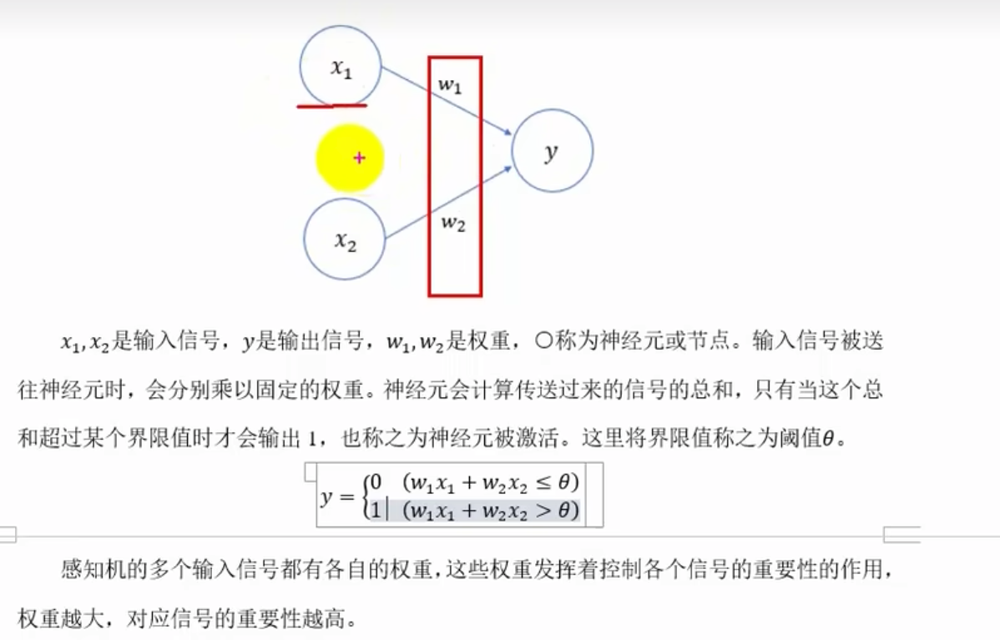
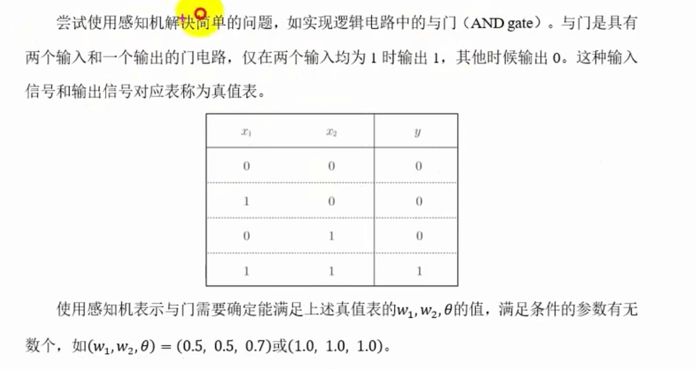
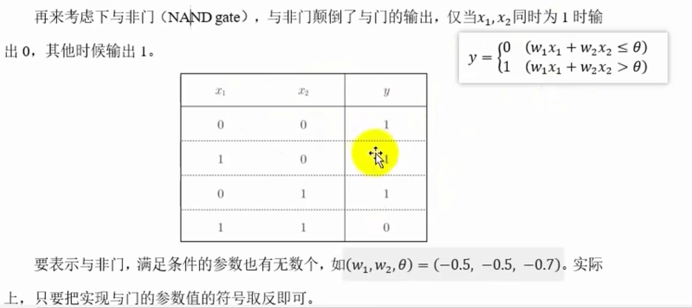
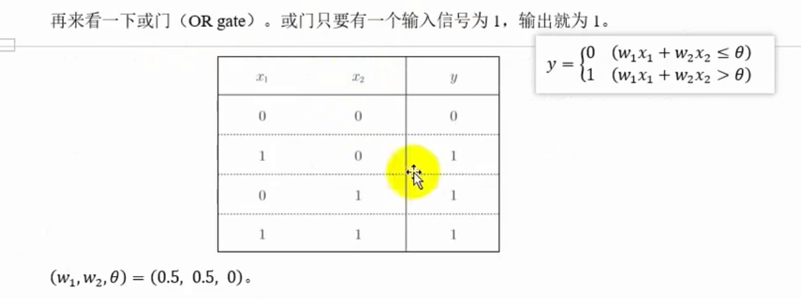
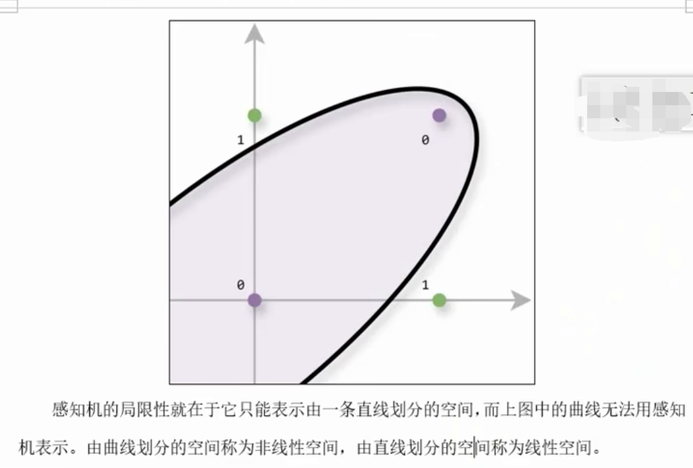
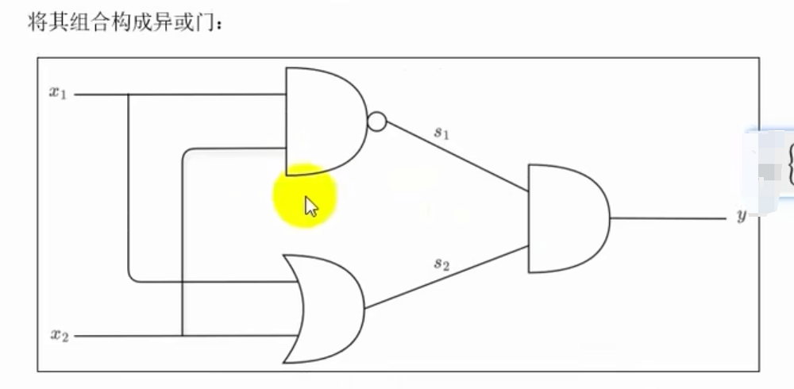
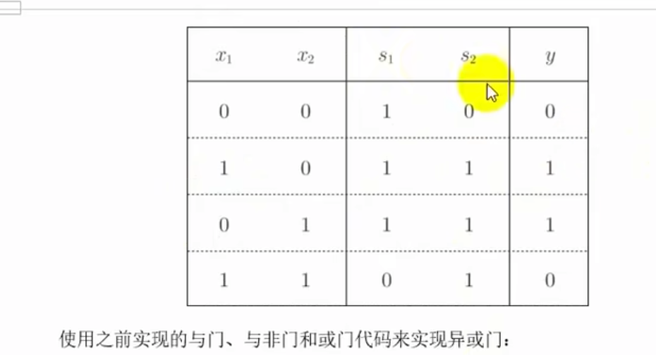
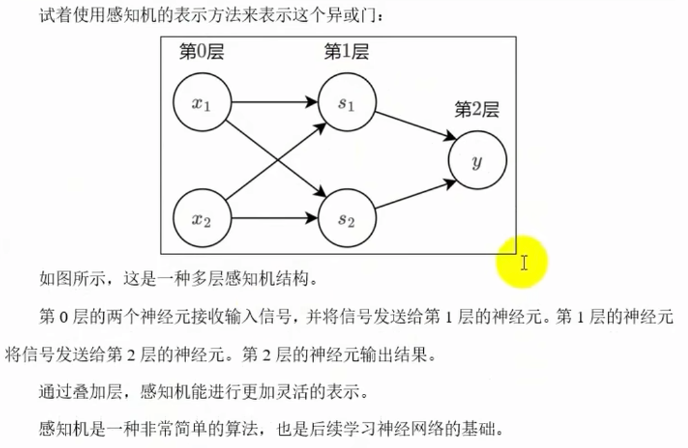

# 感知机
感知机（Perceptron）是最早期的神经网络模型，由Frank Rosenblatt在1957年提出。它是一种二分类模型，通过一个线性函数对输入进行分类。感知机的数学公式为：
$$
f(x) = \begin{cases} 
1 & \text{if } w \cdot x + b > 0 \\
-1 & \text{otherwise} 
\end{cases}
$$
其中，$w$ 是权重向量，$b$ 是偏置项，$x$ 是输入向量。
感知机的训练目标是找到一个超平面，使得正例和反例分别位于超平面的两侧。感知机的训练过程可以通过迭代更新权重向量和偏置项来实现。
感知机的训练过程可以通过迭代更新权重向量和偏置项来实现。具体来说，对于每个输入向量$x$，如果感知机的输出与实际标签$y$不一致，则更新权重向量和偏置项，使得感知机的输出更接近实际标签。
感知机的训练过程可以通过迭代更新权重向量和偏置项来实现。具体来说，对于每个输入向量$x$，如果感知机的输出与实际标签$y$不一致，则更新权重向量和偏置项，使得感知机的输出更接近实际标签。这个过程可以通过以下公式实现：
$$
w := w + \Delta w \\
b := b + \Delta b
$$
其中，$\Delta w = \eta y x$，$\Delta b = \eta y$，$\eta$ 是学习率。
简单示例如下：

## 简单逻辑电路

### 与门

### 与非门

### 或门

## 感知机的局限性
感知机的局限性在于它只能解决线性可分的问题。对于线性不可分的问题，感知机无法找到一个超平面来正确分类数据。
感知机的局限性在于它只能解决线性可分的问题。对于线性不可分的问题，感知机无法找到一个超平面来正确分类数据。因此，感知机的局限性在于它只能解决线性可分的问题。对于线性不可分的问题，感知机无法找到一个超平面来正确分类数据。

## 多层感知机
多层感知机（Multi-Layer Perceptron，MLP）是感知机的扩展，通过添加隐藏层来解决线性不可分的问题。
多层感知机（Multi-Layer Perceptron，MLP）是感知机的扩展，通过添加隐藏层来解决线性不可分的问题。多层感知机由输入层、隐藏层和输出层组成，每个层都由多个神经元组成。输入层接收输入数据，输出层产生输出结果，隐藏层对输入数据进行非线性变换。

