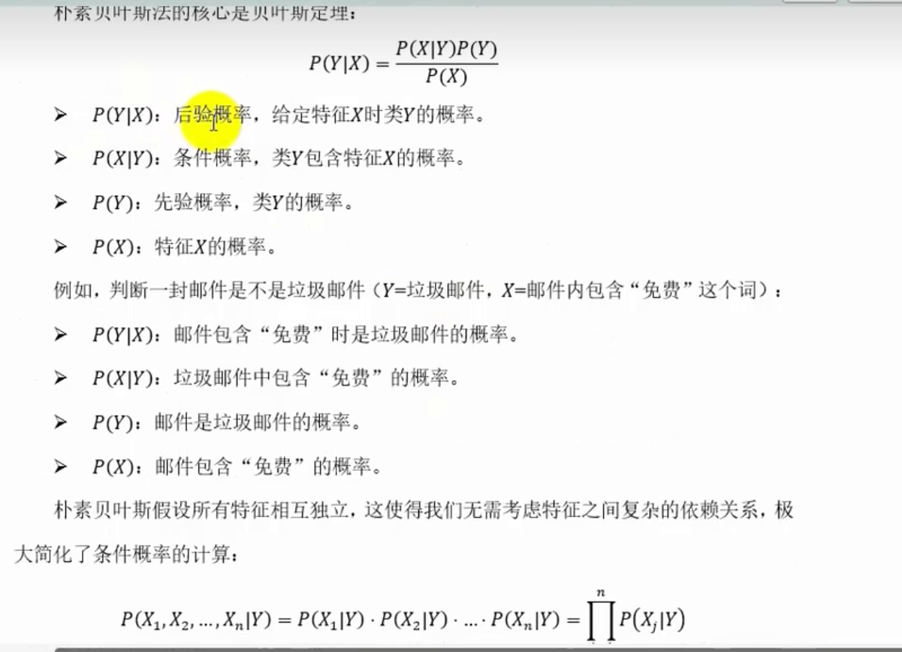
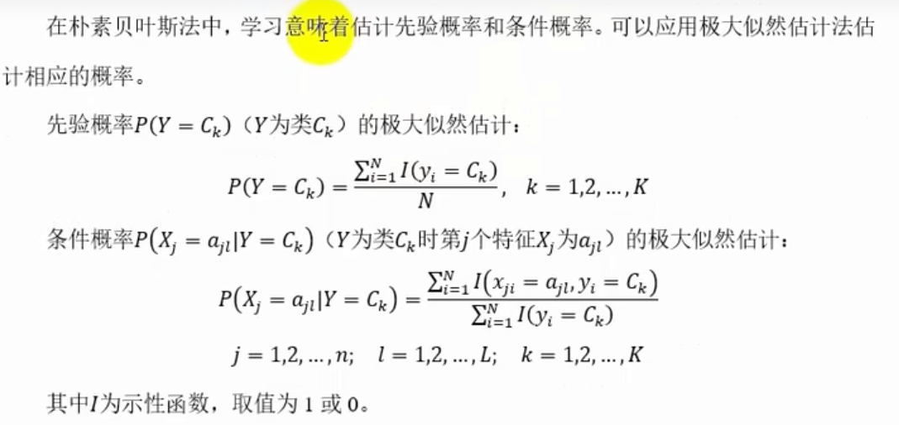
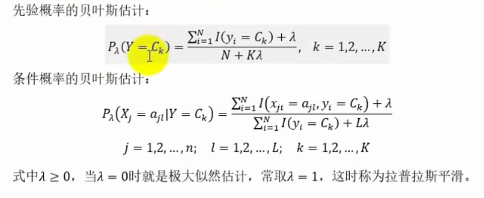
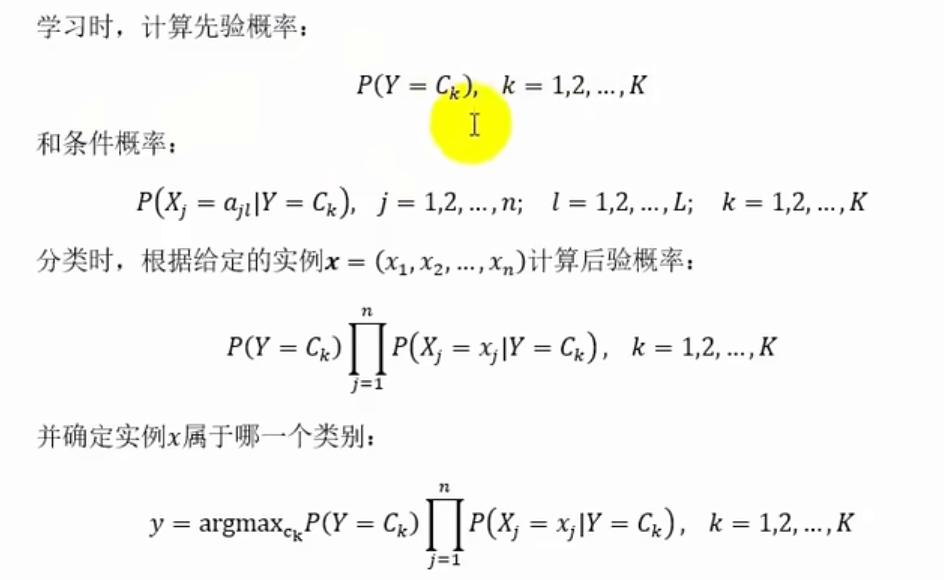

# 监督学习算法 - 朴素贝叶斯法
朴素贝叶斯法（Naive Bayes）是一种基于贝叶斯定理和特征独立假设的分类算法。它通过计算不同类别的概率来对新样本进行分类。朴素贝叶斯法在处理高维数据时具有优势，广泛应用于文本分类、垃圾邮件过滤等领域。  
并且假设特征之间相互独立。朴素贝叶斯算法实现简单，学习与预测的效率都很高，是一种常用的方法，在许多场景下表现得非常好，如文本分类、垃圾邮件过滤、图像识别、情感分析等领域。
## 基本原理
朴素贝叶斯法基于贝叶斯定理，通过计算不同类别的概率来对新样本进行分类。其基本原理如下：
1. 计算先验概率：先验概率是每个类别的概率，表示在没有考虑特征的情况下，样本属于该类别的概率。计算先验概率的公式为：
$$
P(C) = \frac{N_C}{N}
$$
其中，$C$ 表示类别，$N_C$ 表示类别 $C$ 的样本数，$N$ 表示总样本数。
2. 计算条件概率：条件概率是给定特征下，样本属于某个类别的概率。计算条件概率的公式为：
$$
P(X|C) = \frac{N_{XC}}{N_C}
$$
其中，$X$ 表示特征，$N_{XC}$ 表示同时满足特征 $X$ 和类别 $C$ 的样本数。
3. 计算后验概率：后验概率是考虑特征的情况下，样本属于某个类别的概率。计算后验概率的公式为：
$$
P(C|X) = \frac{P(X|C)P(C)}{P(X)}
$$
其中，$P(X)$ 表示特征 $X$ 的概率，可以通过归一化处理得到。
4. 分类：根据后验概率，将样本分类到概率最高的类别。

## 极大似然估计
最大似然估计（Maximum Likelihood Estimation，MLE）是统计学中用于估计参数的方法。通过最大似然估计，可以找到使样本数据最有可能出现的参数值。在朴素贝叶斯法中，最大似然估计用于估计先验概率和条件概率。
通过最大似然估计，可以找到使样本数据最有可能出现的参数值。在朴素贝叶斯法中，最大似然估计用于估计先验概率和条件概率。

## 贝叶斯估计
贝叶斯估计（Bayesian Estimation）是贝叶斯统计学中的一个重要概念。它通过引入先验知识，结合样本数据，对参数进行估计。贝叶斯估计在处理小样本数据时具有优势，可以避免过拟合问题。在朴素贝叶斯法中，贝叶斯估计用于估计先验概率和条件概率。
使用极大似然函数估计可能会出现所要估计的概率为0的情况，这会影响到后验概率的计算结果，使分类产生偏差。解决方法是引入先验概率，即使用贝叶斯估计。

## 学习与分类过程

