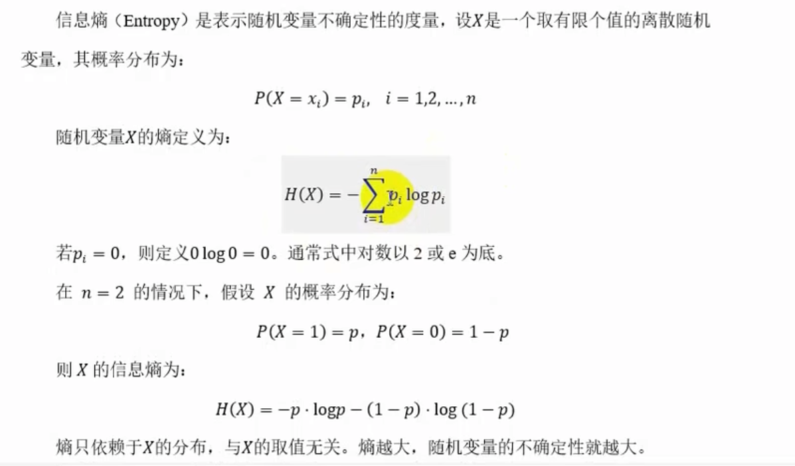
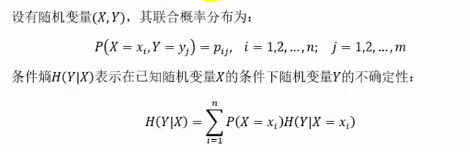
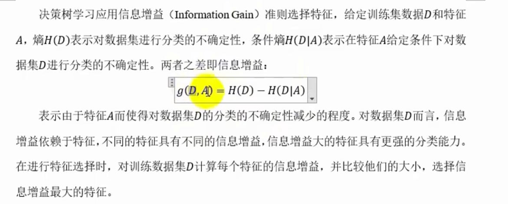
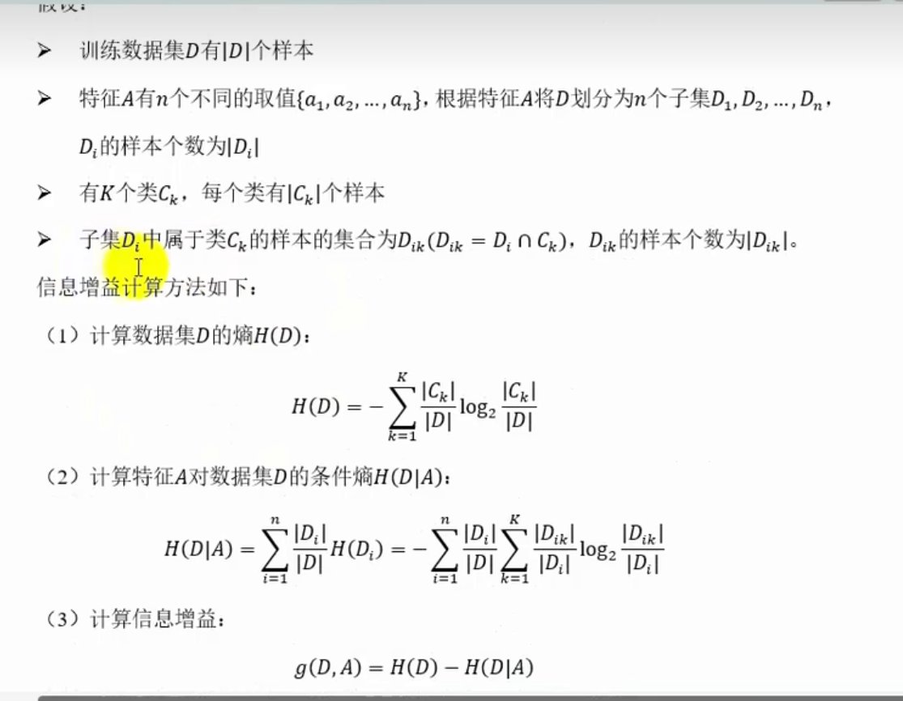
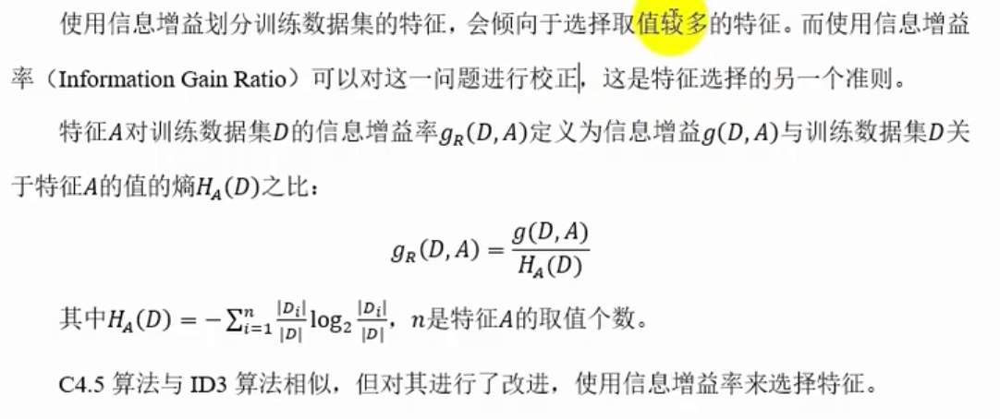
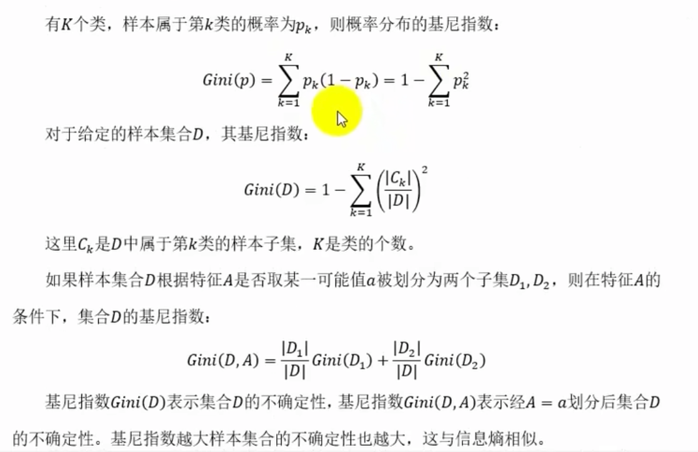
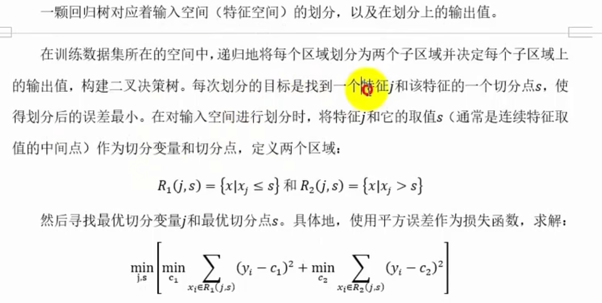
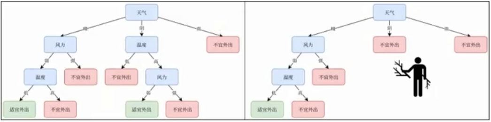

# 监督学习算法 - 决策树
决策树（Decision Tree）是一种监督学习算法，用于分类和回归任务。它通过树状结构进行分类，每个节点表示一个特征，每个分支表示一个决策，每个叶节点表示一个类别或一个回归值。决策树通过递归地将数据集进行划分，最终生成一个树状结构。决策树算法简单，易于理解，广泛应用于分类和回归任务。
## 基本原理
决策树基于树状结构进行分类，每个节点表示一个特征，每个分支表示一个决策，每个叶节点表示一个类别或一个回归值。决策树通过递归地将数据集进行划分，最终生成一个树状结构。决策树算法简单，易于理解，广泛应用于分类和回归任务。
决策树通过递归地将数据集进行划分，最终生成一个树状结构。决策树算法简单，易于理解，广泛应用于分类和回归任务。
## 决策树算法
决策树算法通过递归地将数据集进行划分，最终生成一个树状结构。决策树算法简单，易于理解，广泛应用于分类和回归任务。
## 决策树的实现
决策树的实现通常包括三个步骤：特征选择、树的生成、树的剪枝。树的生成通过递归地将数据集进行划分，最终生成一个树状结构。树的剪枝通过删除一些分支来减少树的复杂度，避免过拟合问题。决策树的实现简单，易于理解，广泛应用于分类和回归任务。
如果特征数量很多，可以在决策树学习之前对特征进行选择，只留下对训练数据有足够分类能力的特征。  
学习的时候通常是递归地的选择最优特征，并根据该特征对训练数据进行划分，使得对各个子数据集有一个最好的分类。  
* 首先构建一个根节点，将所有训练数据都放在根节点。
* 然后选择一个最优特征，根据该特征将数据集进行划分，使得各个子集有一个在当前条件下最好的分类
* 如果这些子集已经能够被基本正确分类，那么构建叶节点，并将这些子集分到所对应的叶节点中去；如果还有子集不能被基本分类，那么就对这些子集选择新最优特征，继续对其进行划分并构建相应的节点
* 如此递归直至所有训练数据子集被基本正确分类，或者没有合适的特征为止。
最后每个子集都被分到叶节点上，即都有了明确的类，这就生成了一颗决策树。决策树的每次划分都相当于在特征空间中引入一个超平面将当期空间一分为二。   
以上方法生成的决策树可能对训练数据有很好的分类能力，但对未知的测试数据却未必，即可能发生过拟合现象。因此需要对已生成的数自下而上进行剪枝，将树变得更简单，从而  
使它具有更好的泛化能能力。具体地，就是去掉过于细分的叶节点，使其退回到父节点或更高的节点，然后将父节点或更高的节点改为新的节点。   
决策树的生成值考虑局部最优，决策树的剪枝则考虑全局最优。
## 决策树的优缺点
1. 优点：决策树算法简单，易于理解，实现简单，计算复杂度低，对缺失数据不敏感，可以处理分类和回归任务。
2. 缺点：决策树容易过拟合，特别是当树的深度较大时。为了解决过拟合问题，可以使用树的剪枝方法，如前剪枝和后剪枝。
## 决策树的可视化
决策树的可视化通过树状图进行展示，每个节点表示一个特征，每个分支表示一个决策，每个叶节点表示一个类别或一个回归值。决策树的可视化有助于理解树的结构和决策过程。

## 特征的选择与决策树生成
特征选择在于选取对训练数据具有分类能力的特征，这样可以提高决策树学习的效率。如果利用一个特征进行分类的结果与随机
分类的结果没有很大差别，则称这个特征是没有分类能力的，经验上扔掉这样的特征对决策树学习的精度影响不大。通常选择的准则是信息增益或信息增益率。

1 ） 信息熵  
信息熵（Entropy）是衡量数据集纯度的指标，取值范围在0到1之间。信息熵越小，数据集越纯。信息熵的公式为：
$$
H(X) = -\sum_{i=1}^{n} p(x_i) \log_2 p(x_i)
$$
其中，$X$ 表示随机变量，$x_i$ 表示 $X$ 的取值，$p(x_i)$ 表示 $X$ 取 $x_i$ 的概率。

2）信息增益与ID3  
信息增益（Gain）是衡量特征对数据集纯度的指标，取值范围在0到1之间。信息增益越小，特征对数据集纯度的贡献越小。信息增益的公式为：
$$
Gain(X, A) = H(X) - \sum_{i=1}^{n} \frac{p_i}{p} H(X|A_i)
$$
其中，$X$ 表示随机变量，$A$ 表示特征，$p_i$ 表示 $A$ 的取值为 $a_i$ 的概率，$H(X|A_i)$ 表示 $X$ 在 $A$ 的取值为 $a_i$ 的条件下，$X$ 的信息熵。
信息增益率（Gain Ratio）是信息增益的归一化，取值范围在0到1之间。信息增益率越小，特征对数据集纯度的贡献越小。信息增益率的公式为：
$$
GainRatio(X, A) = \frac{Gain(X, A)}{\log_2 |A|}
$$
其中，$X$ 表示随机变量，$A$ 表示特征，$|A|$ 表示特征 $A$ 的取值个数。

3)  信息增益率与C4.5

4)  基尼指数与CART

5) CART回归树

## 决策树的剪枝
决策树出现过拟合的原因在于学习时过多的考虑如何提高对训练数据的正确分类，从而构建出过于复杂的决策树。为了避免过拟合，可以对已   
生成的决策树进行剪枝，从决策树上裁掉一些子树或叶节点，并将其根节点或父节点作为新的叶节点，从而简化模型。

决策树的剪枝通常分为预剪枝和后剪枝。   
预剪枝是在决策树生成过程中，通过设置一些限制条件提前停止树的生长，避免过度分裂。常见的停止条件有：限制最大的树的深度、限制每个  
节点最小样本数、限制最小的误差减少量，限制最大叶节点数量等。但过于严格的限制条件可能会导致欠拟合，并且可能难以确定最佳阈值，需要  
多次尝试。   
后剪枝是在决策树完全生成后，基于某种测评准则从底部向上逐步判断是否移除分支。常见的后剪枝方法有代价复杂度剪枝和减少误差剪枝等。