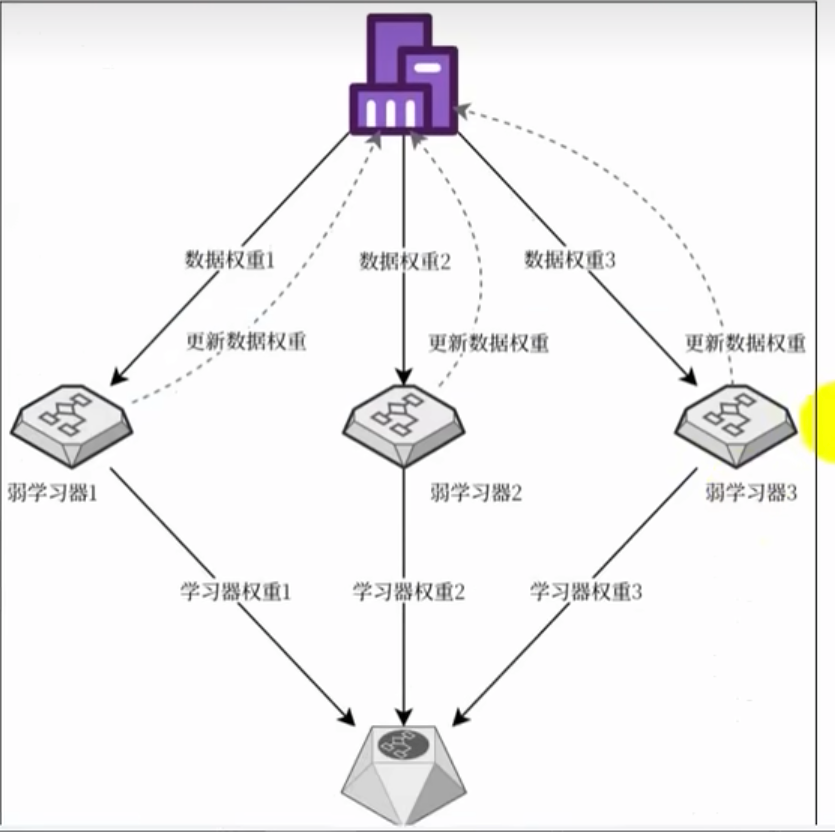
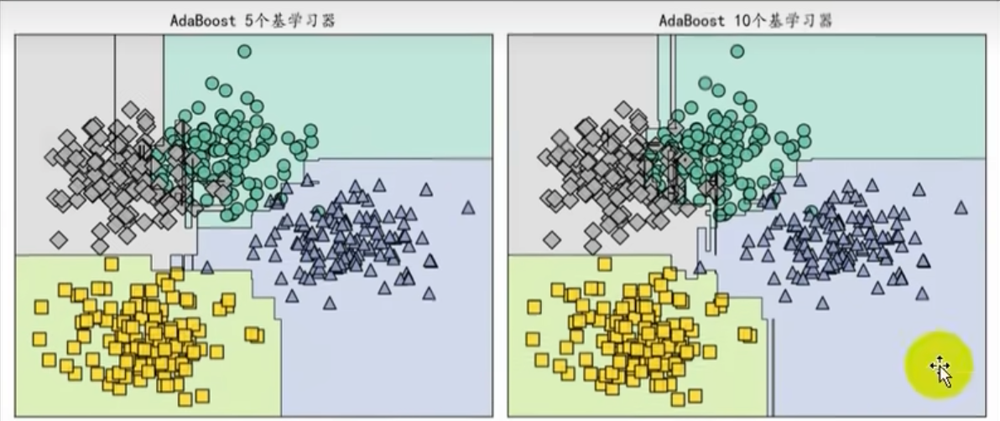
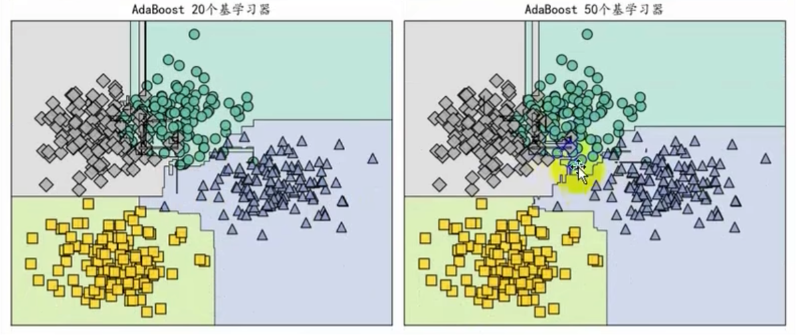
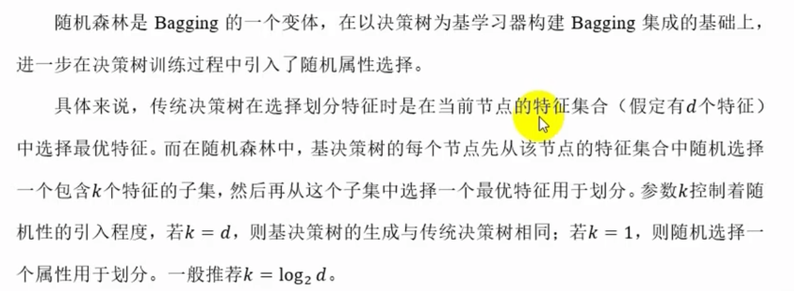
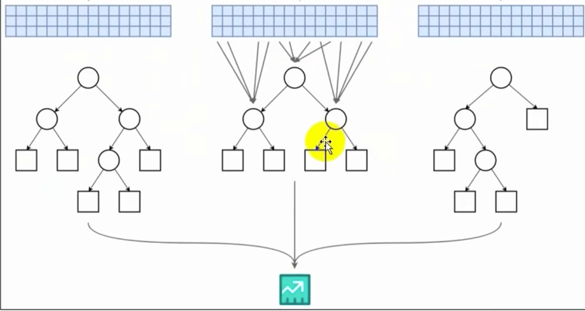
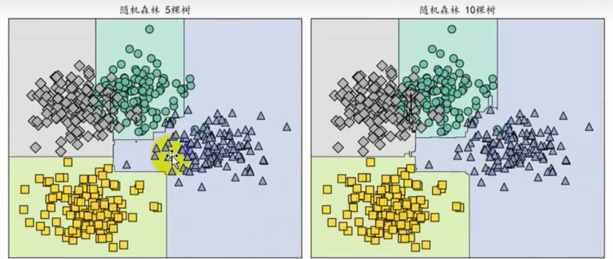
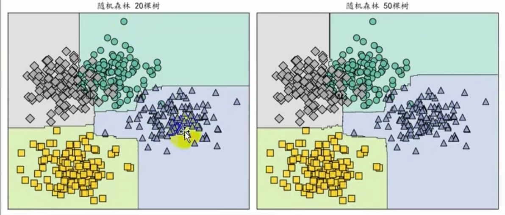

# 集成学习
集成学习（Ensemble Learning）是机器学习中的一个方法，通过将多个弱分类器或回归器组合成一个强分类器或回归器，从而提高模型的准确性和泛化能力。
集成学习通过将多个弱分类器或回归器组合成一个强分类器或回归器，从而提高模型的准确性和泛化能力。

集成学习（Ensemble Learning）通过某种策略组合多个个体学习器的预测结果来提高整体的预测能力。只包含同种类型的个体学习器的集成称为同质集成，
例如决策树集成中全是决策树，同质集成中的个体学习器又称为基学习器，相应的学习算法称为基学习器算法。包含不同类型的个体学习器称为异质集成。例如
同时包含决策树和神经网络。
集成学习有三大经典方法：Bagging、Boosting和Stacking。

## Bagging
Bagging（Bootstrap Aggregating）是集成学习中的一种方法，通过使用多个训练样本的子集来训练多个个体学习器，然后将这些个体学习器的预测结果进行平均或投票，从而得到最终的预测结果。
Bagging通过使用多个训练样本的子集来训练多个个体学习器，然后将这些个体学习器的预测结果进行平均或投票，从而得到最终的预测结果。
Bagging 自助聚合，从原始数据集中通过有放回的对样本采样生成生成多个子数据集，分别训练多个独立模型，最后通过投票（分类）或平均（回归）得到结果。
随机森林则是在Bagging基础上随机选择特征子集训练每棵树。Bagging主要关注于降低方差。

## Boosting
Boosting（Boosting）是集成学习中的一种方法，通过将多个弱分类器或回归器组合成一个强分类器或回归器，从而提高模型的准确性和泛化能力。
Boosting通过将多个弱分类器或回归器组合成一个强分类器或回归器，从而提高模型的准确性和泛化能力。
Boosting （提升方法）按顺序训练模型，每个模型关注前一个模型的错误，通过加权调整来优化整体预测。如AdaBoost通过给错分的样本更大的权重，
逐步改进；梯度提升树用梯度下降法优化损失函数；XGBoost和LightGBM是高效的梯度提升树的变种。Boosting主要关注降低偏差。

## Stacking
Stacking（Stacking）是集成学习中的一种方法，通过将多个弱分类器或回归器组合成一个强分类器或回归器，从而提高模型的准确性和泛化能力。
Stacking通过将多个弱分类器或回归器组合成一个强分类器或回归器，从而提高模型的准确性和泛化能力。
Stacking 堆叠 训练多个不同类型的个体学习器，之后使用一个元模型综合多个个体学习器的预测。灵活性强，能结合多种模型的优势。

### Boosting代表AdaBoost
AdaBoost（Adaptive Boosting）是Boosting的一种实现，通过给错分的样本更大的权重，使得后续模型关注这些样本，从而提高模型的准确性和泛化能力。
AdaBoost通过给错分的样本更大的权重，使得后续模型关注这些样本，从而提高模型的准确性和泛化能力。
在概率近似正确学习的框架中，一个概念如果存在一个多项式的学习算法能够学习它，并且正确率很高，就称这个概念是弱可学习的。后来证明，强可学习与弱可学习
是等价的。那么如果已经发现了弱学习算法，能否通过某种方式将其提升为强学习算法呢？   

对于分类问题而言，给定一个训练样本集，求比较粗糙的分类规则（若分类器）要比求精确的分类规则（强分类器）容易得多。Boosting就是从弱学习算法出法，反复学习，
得到一系列弱分类器，然后组合这些弱分类器构成一个强分类器。AdBoost通常使用单层决策树作为基学习器，单层决策树也被称为决策树桩。   

大多数Boosting都是改变训练数据的概率分布（权重分布），针对不同的训练数据分布调用弱学习算法学习一系列弱分类器。AdaBoost 自适应提升的做法
是提高被前一轮弱分类器错误分类的样本的权重，降低被正确分类的样本的权重。这样一来后一轮弱学习器会更加关注那些没有被正确分类的数据。同时采用加权
多数表决的方法，加大分类误差率小的弱分类器的权重，减小分类误差率大的弱分类器权重。

### Bagging代表之随机森林
随机森林（Random Forest）是Bagging的一种实现，通过随机选择特征子集训练每棵树，从而提高模型的准确性和泛化能力。
随机森林通过随机选择特征子集训练每棵树，从而提高模型的准确性和泛化能力。
随机森林随机选择特征子集训练每棵树，从而提高模型的准确性和泛化能力。

    

