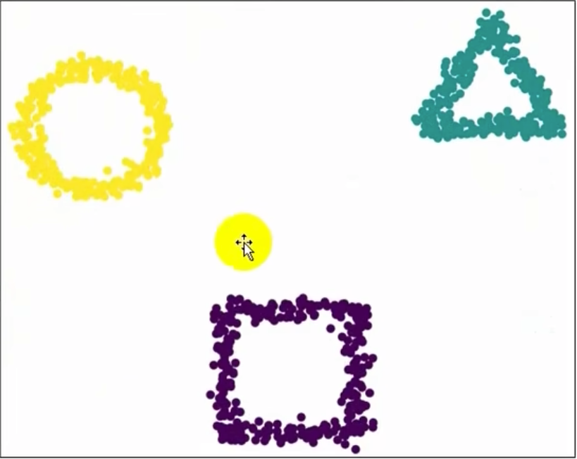
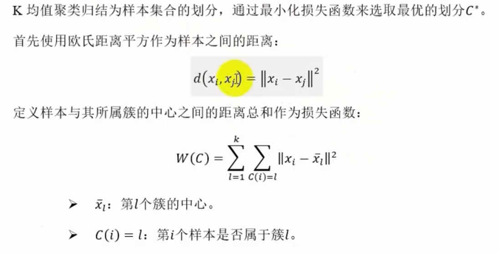
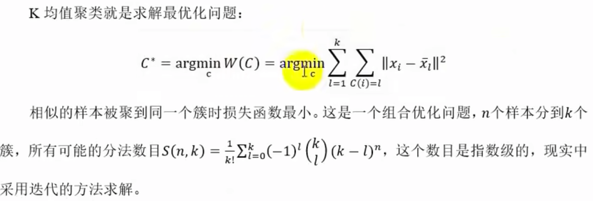
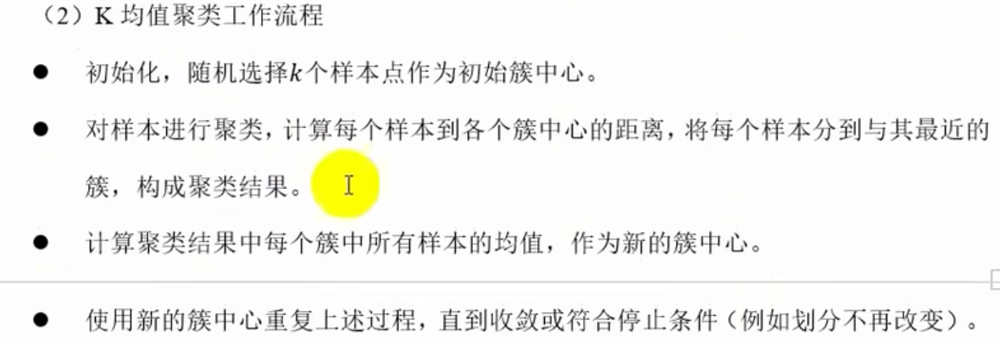
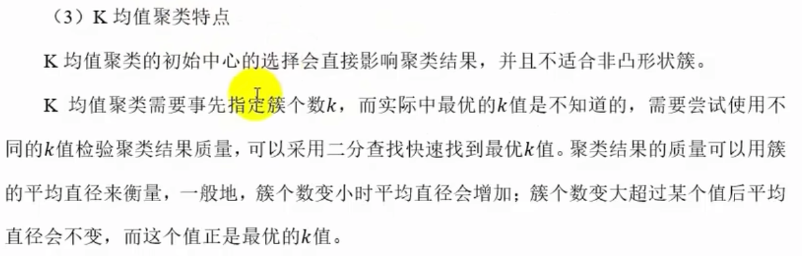
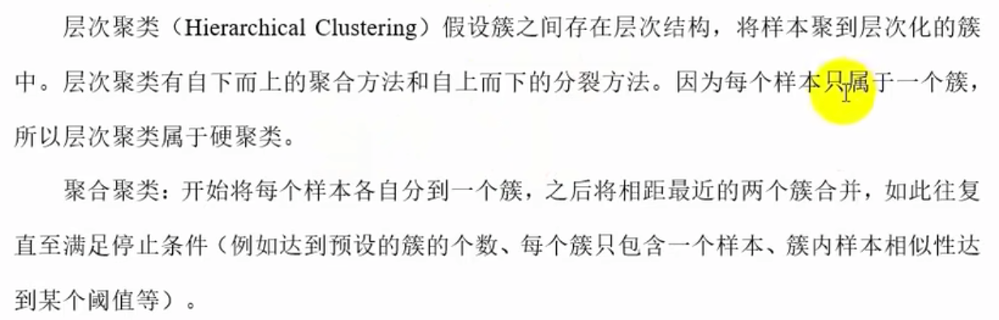
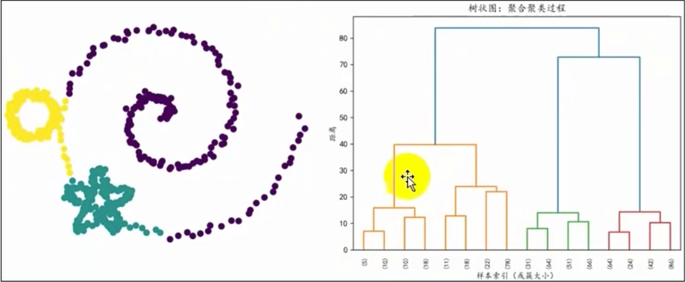
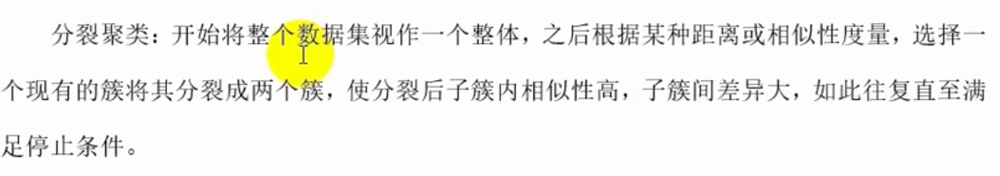
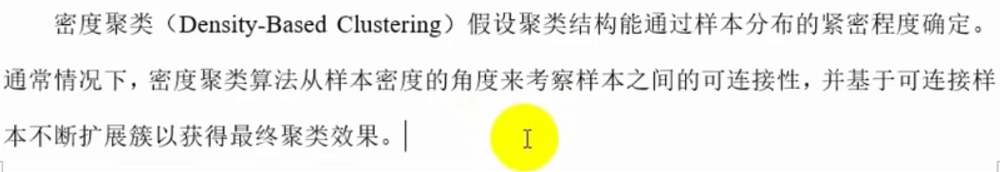

# 无监督学习

## 无监督学习之聚类
聚类（Clustering）是无监督学习中的一个方法，通过将数据集中的样本进行分组，使得组内样本相似，组间样本不相似，从而实现数据的分类。
聚类旨在将数据集中的样本分成若干个簇，使得同一个簇内的对象彼此相似，不同簇间的对象差异较大。聚类是一种无监督学习算法，不需要预先
标记数据的标签，完全依赖数据本身内在结构和特征来进行分组，最终簇所对应的概念语义需由使用者来把握和命名。
聚类的核心是“物以类聚”，具体通过以下步骤实现：
* 定义相似性：选择一个度量标准（如欧式距离，余弦相似度）来衡量对象之间的相似性或距离
* 分组：根据相似性将对象分配到不同簇中。
* 优化：通过迭代或直接计算，调整粗的划分，使簇内相似性最大化，簇间差异最大化。

聚类应用场景：
市场细分： 将消费者按购买习惯分组
图像分割：将图像像素按颜色或纹理聚类
异常检测：识别不属于任何主要簇的异常点
生物信息：对基因表达数据进行分组

[//]: # (1. 初始化：随机选择k个样本作为初始簇中心。)

[//]: # (2. 分配：将所有样本分配到最近的簇中心，形成k个簇。)

[//]: # (3. 更新：计算簇内所有样本的均值，得到新的簇中心。)

[//]: # (4. 重复步骤2和步骤3，直到簇中心不再变化或达到预设的迭代次数。)
### 常见聚类算法
* K-means  
K均值聚类（K-means）是基于样本计划划分的聚类方法，将样本集合划分为k个子集构成k个簇，将n个样本分到k个簇中，每个样本到其所属
簇的中心的距离最小。每个样本只能属于一个簇，所以K均值聚类是硬聚类。

* 层次聚类

* 密度聚类 DBSCAN

## 无监督学习之降维