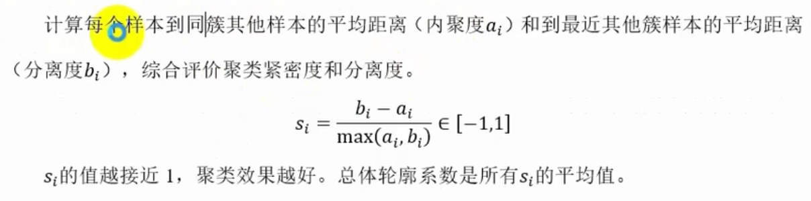
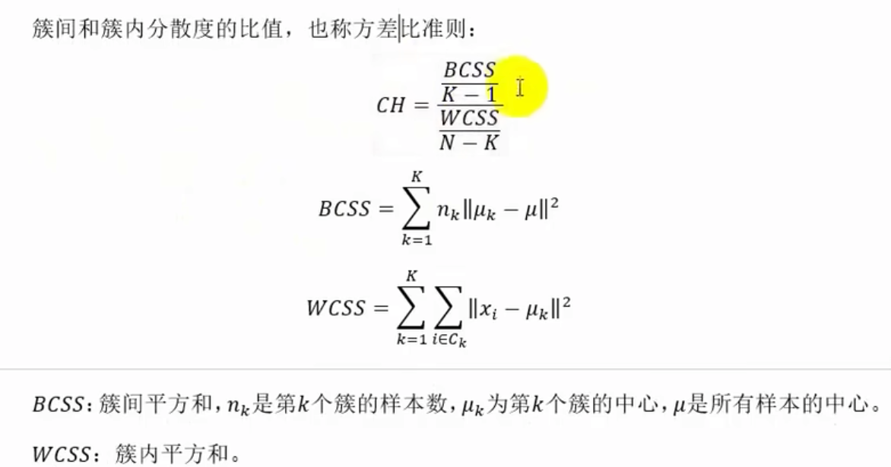
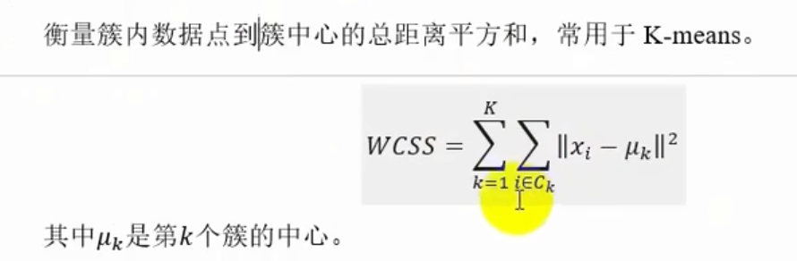
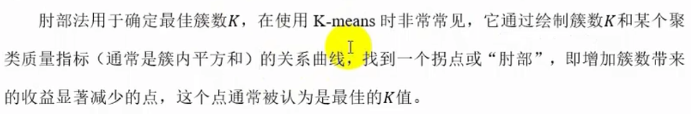
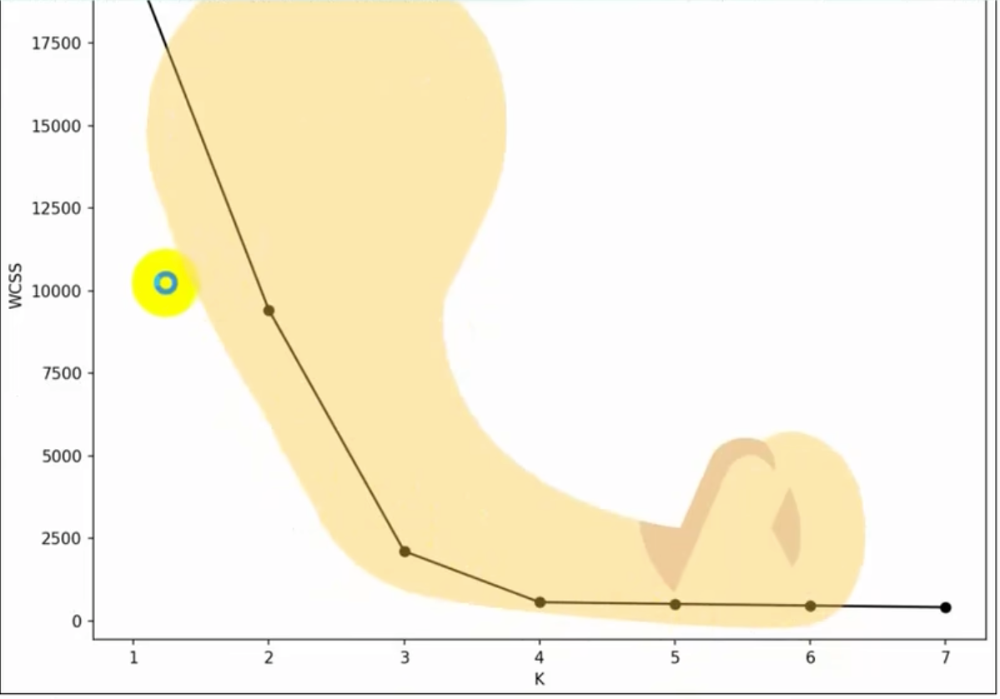

# 聚类模型评估
由于聚类任务没有预定义的标签（不像监督学习有真实类别可供比较），所以需要依赖聚类结果和原始数据来衡量模型好坏，
主要关注簇内的紧凑性和簇间的分离性。
常用的聚类模型评估指标有：轮廓系数（Silhouette Score）、Calinski-Harabasz指数、Davies-Bouldin指数等。
## 轮廓系数（Silhouette Score）
轮廓系数用于衡量样本点与自己所属簇的相似性与与其它簇的不相似性，取值范围为[-1, 1]，值越接近1表示簇内相似性越小，簇间差异越大，模型效果越好。

## Calinski-Harabasz 指数
Calinski-Harabasz指数用于衡量簇内相似性和簇间差异性，取值范围为[0, +∞]，值越大表示模型效果越好。

## Davies-Bouldin指数
Davies-Bouldin指数用于衡量簇内相似性和簇间差异性，取值范围为[0, +∞]，值越小表示模型效果越好。
## 簇内平方和（Within-Cluster Sum of Squares)
簇内平方和用于衡量簇内相似性，取值范围为[0, +∞]，值越小表示簇内相似性越大，模型效果越好。
  
## 肘部法
肘部法用于确定聚类数量，取簇内平方和的肘部作为聚类数量。

