# 降维
降维是将高维数据映射到低维空间的过程，常用的方法有PCA、t-SNE、UMAP等。
PCA（Principal Component Analysis）是一种线性降维方法，通过找到数据的主成分（即方差最大的方向）来降维。
t-SNE（t-Distributed Stochastic Neighbor Embedding）是一种非线性降维方法，通过模拟数据在高维空间中的相似性来降维。
UMAP（Uniform Manifold Approximation and Projection）是一种非线性降维方法，通过找到数据的均匀子空间来降维。
SVD（Singular Value Decomposition）是一种线性降维方法，通过找到数据的奇异值分解来降维。
LLE（Locally Linear Embedding）是一种非线性降维方法，通过找到数据的局部线性结构来降维。
MDS（Multidimensional Scaling）是一种非线性降维方法，通过找到数据的低维表示来降维。
ISOMAP（Isometric Feature Mapping）是一种非线性降维方法，通过找到数据的等距嵌入来降维。
Laplacian Eigenmaps（拉普拉斯特征映射）是一种非线性降维方法，通过找到数据的拉普拉斯特征来降维。
Hessian LLE（Hessian Locally Linear Embedding）是一种非线性降维方法，通过找到数据的Hessian矩阵的特征来降维。
Modified LLE（Modified Locally Linear Embedding）是一种非线性降维方法，通过修改LLE的算法来降维。
Sparse LLE（Sparse Locally Linear Embedding）是一种非线性降维方法，通过找到数据的稀疏表示来降维。

## 奇异值分解
奇异值分解(SingularValue Decomposition,SVD)是一种矩阵因子分解方法,用于将矩阵分解为更简单的形式,从而揭示数据的内在结构和特性。通过保留最大的几个奇异值及其
对应的奇异向量,可以近似重构原始矩阵,减少数据维度,同时保留主要信息。主成分分析, 潜在语义分析等都用到了奇异值分解。
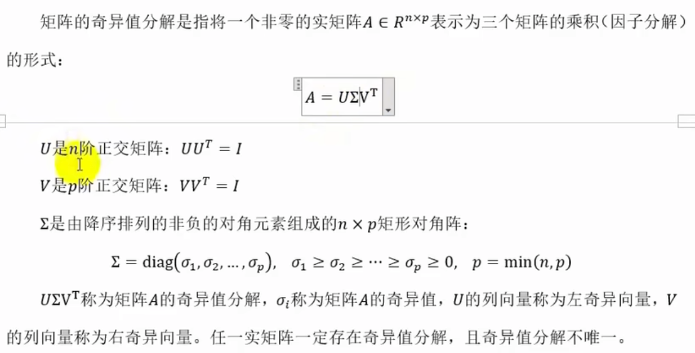 
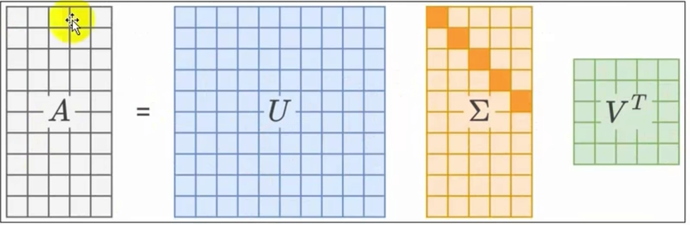
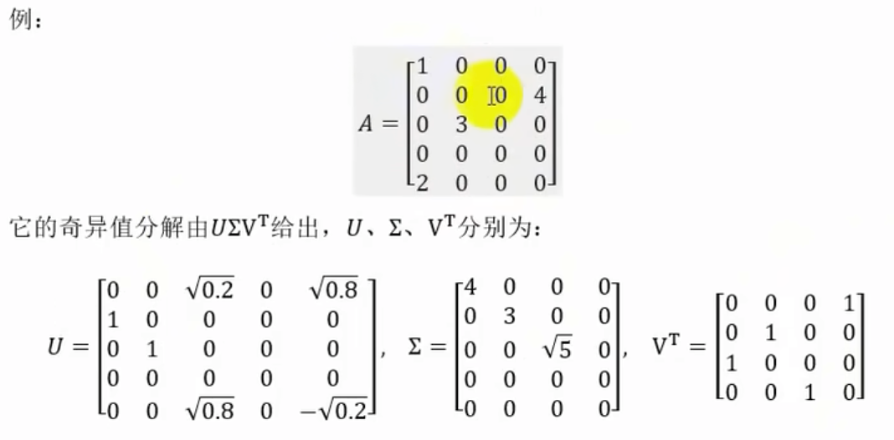
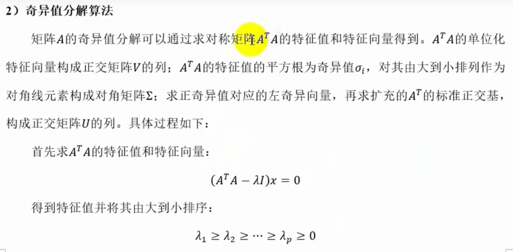
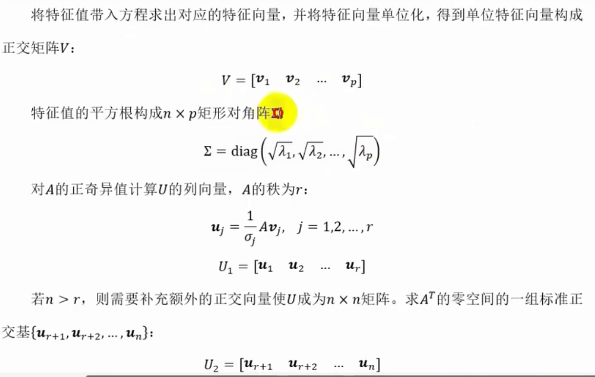
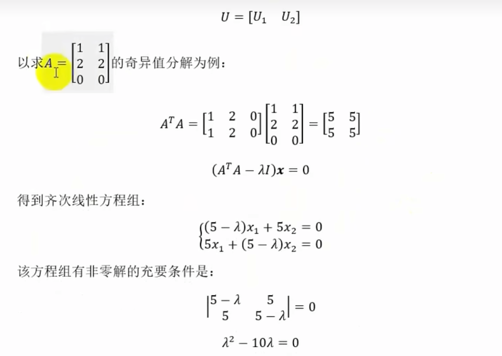
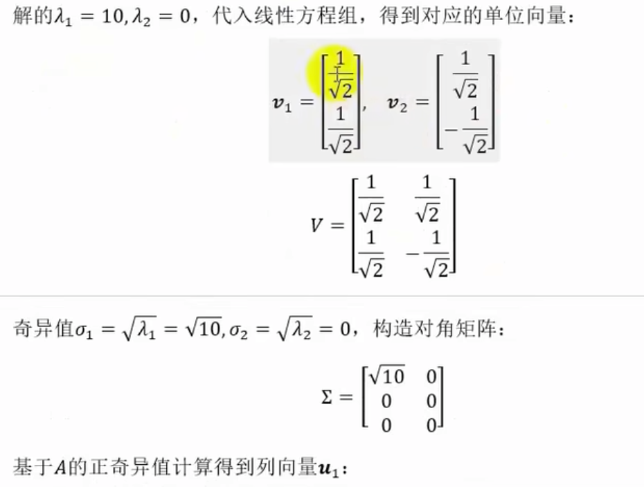
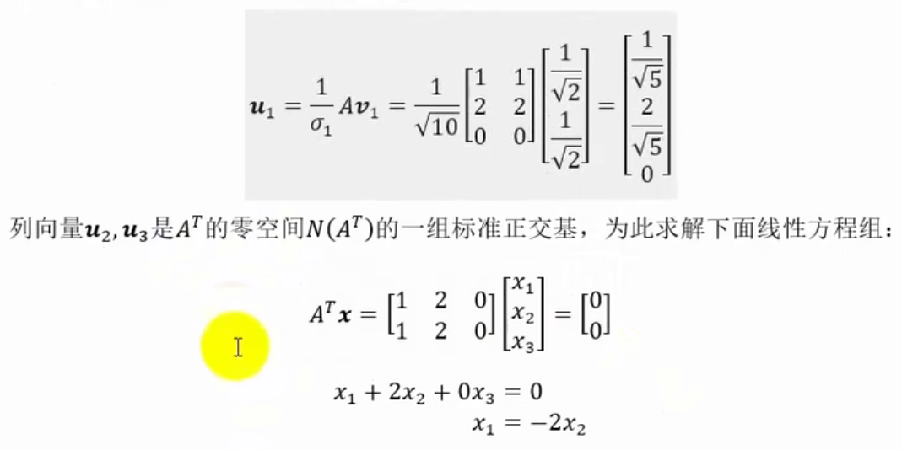
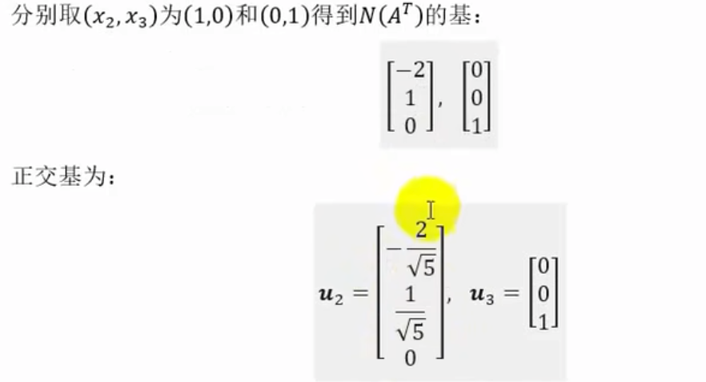
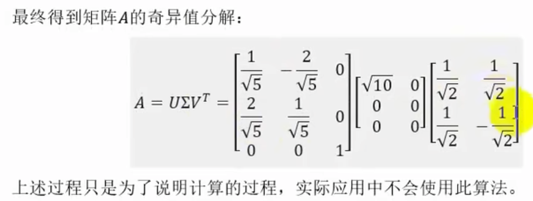
## 主成分分析
主成分分析(Principal Component Analysis,PCA)是一种线性降维方法,通过找到数据的主成分（即方差最大的方向）来降维。
 
主成分分析(Principal Component Analysis,PCA)是一种常用的无监督学习方法,旨在 找到数据中 最重要的方向",即方差最大的方向,并用这些方向重新表达数据。
在主成分分析过程中,首先将数据的每个特征规范化为平均值为0方差为1,以消除不 同特征之间量纲的差异,再使用正交变换把线性相关的原始数据转换为线性无关的新数据
(主成分)。主成分彼此正交并且能够最大化地保留原始数据的方差信息。主成分分析主要用于降维和发现数据的基本结构。  

主成分分析可直观解释为对数据所在的原始坐标系进行旋转转变换,将数据投影到新坐标系的坐标轴上,新坐标系的第一坐标轴、第二坐标轴等分别表表示第一主成分、第二主成分等。
数据在每一轴上的坐标值的平方表示相应变量的方差,并且这个坐标系是所有可能的新坐标系中,坐标轴上的方差的和最大的。

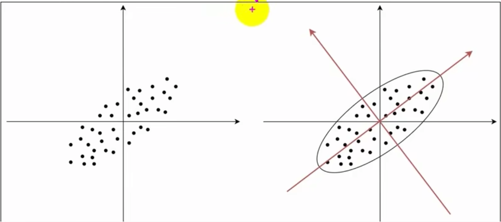
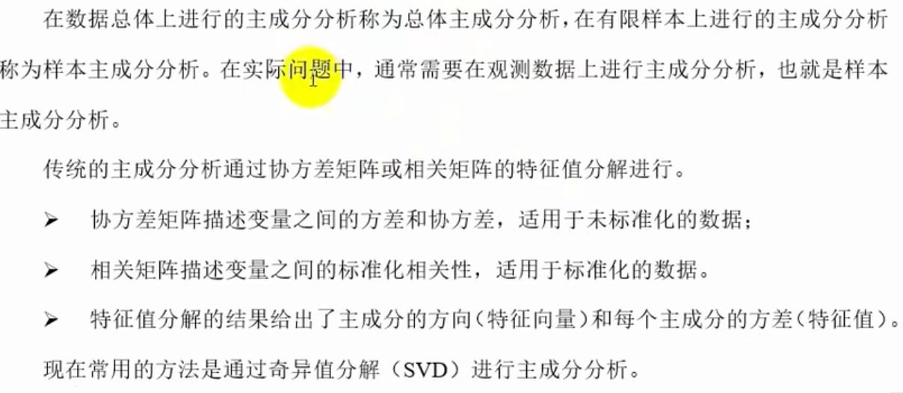

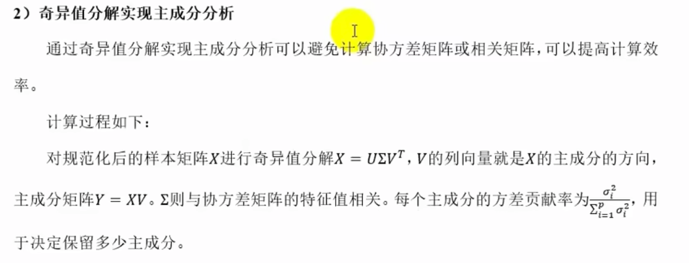
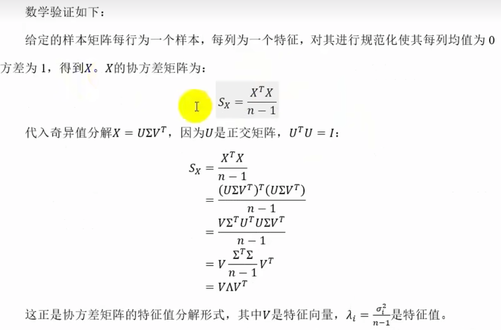