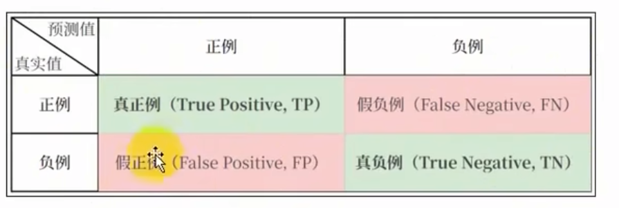

# 回归模型评价指标
### 平均绝对误差 MAE
$$
MAE = \frac{1}{n} \sum_{i=1}^{n} |y_i - \hat{y}_i|
$$
MAE 通常对异常值不敏感，解释直观，适用于数据包含异常值的情况。
### 均方误差 MSE
$$
MSE = \frac{1}{n} \sum_{i=1}^{n} (y_i - \hat{y}_i)^2
$$
MSE 会放大较大误差，对异常值敏感，适用于需要惩罚大误差的场景。
### 均方根误差 RMSE
$$
RMSE = \sqrt{\frac{1}{n} \sum_{i=1}^{n} (y_i - \hat{y}_i)^2}
$$
RMSE 与MSE 类似，但量纲与目标变量一直，适用于需要直观误差量纲的场景。如果一味的
试图降低RMSE,可能会导致模型对异常值的拟合度很高，容易过拟合。
### R平方误差 R^2(决定系数)
$$
R^2 = 1 - \frac{\sum_{i=1}^{n} (y_i - \hat{y}_i)^2}{\sum_{i=1}^{n} (y_i - \bar{y})^2}
$$
R^2 越接近1，模型拟合越好；越接近0，模型拟合越差。
衡量模型对目标变量的解释能力，越接近1越好，对异常值敏感。 

# 分类模型评价指标
对于分类问题，，最常用的指标是“准确率”，它定义为分类器对测试集正确分类的样本数与总样本数据值比
此外还有一系列常用的评价指标。

### 混淆矩阵

### 准确率
$$
Accuracy = \frac{TP + TN}{TP + TN + FP + FN}
$$
### 精确率
$$
Precision = \frac{TP}{TP + FP}
$$
### 召回率
$$
Recall = \frac{TP}{TP + FN}
$$
### F1分数
$$
F1 = 2 \cdot \frac{Precision \cdot Recall}{Precision + Recall}
$$
F1分数越接近1，模型的精确率和召回率越高，越有利于模型的优化。

### ROC 曲线
ROC曲线是ROC曲线下的面积AUC。AUC越接近1，模型的分类能力越强。ROC曲线是ROC曲线下的面积AUC。AUC越接近1，模型的分类能力越强。
公式如下：
$$
AUC = \frac{1}{2} \left(1 + \frac{TP}{TP + FN} + \frac{TN}{TN + FP} + \frac{TP \cdot TN}{(TP + FN) \cdot (TN + FP)}\right)
$$
FPR (False Positive Rate) 假正率
$$
FPR = \frac{FP}{FP + TN}
$$
TPR (True Positive Rate) 真正率
$$
TPR = \frac{TP}{TP + FN}
$$
ROC 曲线，是评估二分类模型性能的工具，以假正率为横坐标，真正率为纵坐标绘制的曲线。
展示不同阈值下的分类效果，绘制ROC曲线时，从高到低变化阈值，计算不同阈值下的FPR和TPR，并绘制曲线。

### AUC (Area Under the Curve)
AUC (Area Under the Curve) 是ROC曲线下的面积，越接近1，模型的分类能力越强。
AUC 是代表ROC曲线下的面积，AUC 的值越大，模型区分正负类的能力越强，模型性能越好，AUC值=0.5时，表示  
模型接近随机猜测，AUC=1 则代表完美模型。

