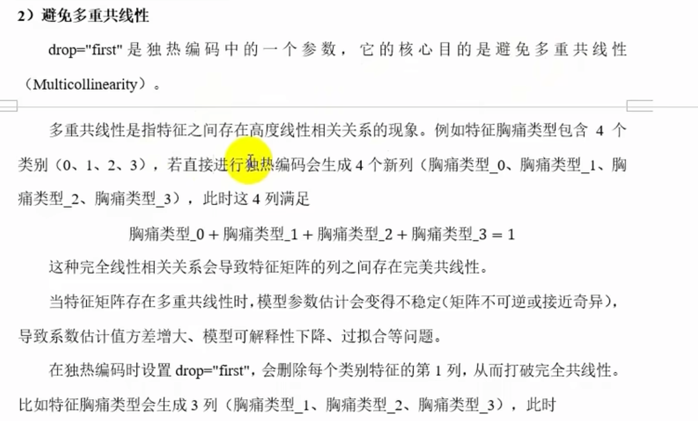
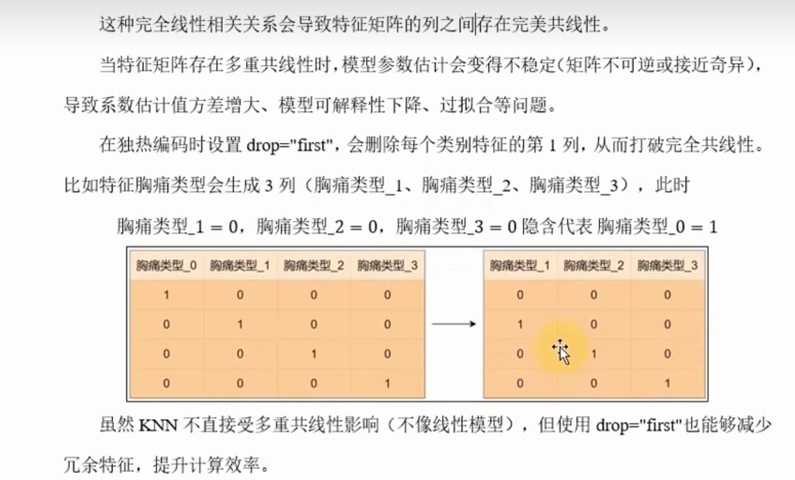

# 归一化和标准化
归一化和标准化是数据预处理中的两个重要概念，它们都用于将数据转换为相同的尺度，以便于模型的训练和预测。
归一化（Normalization）是将数据缩放到一个特定的范围，通常是[0, 1]或[-1, 1]。归一化常用的方法有最小-最大归一化、Z-score归一化等。
标准化（Standardization）是将数据转换为均值为0，方差为1的分布。常用的方法有Z-score标准化、标准化等。
归一化和标准化的区别在于，归一化是将数据缩放到一个特定的范围，而标准化是将数据转换为均值为0，方差为1的分布。
归一化和标准化都是数据预处理中的重要步骤，它们可以提高模型的训练速度和预测精度。
在实际应用中，归一化和标准化的选择取决于数据的分布和模型的要求。
归一化和标准化都是数据预处理中的重要步骤，它们可以提高模型的训练速度和预测精度。在实际应用中，归一化和标准化的选择取决于数据的分布和模型的要求。

## 归一化
定义：
归一化（Normalization）是将数据缩放到一个特定的范围，通常是[0, 1]或[-1, 1]。归一化常用的方法有最小-最大归一化、Z-score归一化等。
公式：
$$
x' = \frac{x - x_{min}}{x_{max} - x_{min}}
$$
[-1,1]的公式:
$$
x' = \frac{x - x_{min}}{x_{max} - x_{min}} \times 2 - 1
$$

目的：
- 消除量纲差异：不同特征的单位或量纲可能差异巨大（例如，身高和体重），归一化可以消除量纲差异，避免模型被打范围特征主导。  
- 加速模型收敛：对于梯度下降等优化算法，归一化后特征处于相近的尺度，优化路径更平滑，收敛速度更快。
- 适配特定模型：模型模型（如神经网络、K近邻、SVM）对输入数据的范围敏感，归一化能够显著提升性能。

场景：

归一化不改变原始分布，但对异常值比较敏感。当数据分布有明显边界(如图像像素值，文本词频)，或模型对输入范围敏感可以考虑归一化。

## 标准化
定义：
标准化（Standardization）是将数据转换为均值为0，方差为1的分布。常用的方法有Z-score标准化、标准化等。
公式：
$$
x' = \frac{x - \mu}{\sigma}
$$
其中，$\mu$ 表示数据的均值，$\sigma$ 表示数据的标准差。
目的：
- 消除量纲差异：不同特征的单位或量纲可能差异巨大（例如，身高和体重），标准化可以消除量纲差异，避免模型被打范围特征主导。  
- 加速模型收敛：对于梯度下降等优化算法，标准化后特征处于相近的尺度，优化路径更平滑，收敛速度更快。
- 适配特定模型：模型模型（如神经网络、K近邻、SVM）对输入数据的范围敏感，标准化能够显著提升性能。
场景：
标准化改变原始分布，但对异常值不敏感。当数据分布呈 bell 形曲线，或模型对输入范围不敏感可以考虑标准化。 

目的：
适应数据分布：将数据转换为均值为0，标准差为1的分布，适合假设数据服务正太分布的模型（如线性回归、逻辑回归）。
稳定模型训练：标准化后的数据对异常值的敏感度较低（相比归一化），鲁棒性更强。
统一特征尺度：与归一化类似，标准化也能消除量纲差异，但更关注数据的统计分布而非固定范围。
场景：
大多数场景标准化更通用，尤其数据分布未知或存在轻微异常值时。

## 心脏疾病预测案例，特征工程时的问题：
多重共线性

