# 支持向量机
支持向量机（Support Vector Machine，SVM）是一种监督学习算法，用于分类和回归任务。它通过找到一个最优的超平面将数据集进行划分，使得不同类别的数据点被尽可能多地分开。支持向量机通过最大化类间间隔来实现这一点，从而提高分类的准确性和泛化能力。
支持向量机是一种二分类模型。其核心目标是寻找一个“间隔最大”的超平面将不同类别的数据点分隔开。这个超平面在二维平面中是一条直线，在三维空间中，是一个平面，在更高维空间中则是一个超平面。
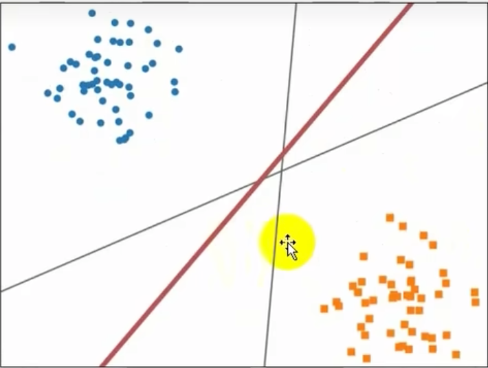
间隔最大的代表该超平面与最近的数据点之间的距离最大，这使得支持向量机有较强的泛化能力。  
支持向量机学习方法包括由简至繁：线性可分支持向量机、线性支持向量机以及非线性支持向量机。

# 线性可分支持向量机-硬间隔
线性可分支持向量机（Linearly Separable Support Vector Machine，LSSVM）是一种线性分类模型，用于线性可分问题。其目标是找到一个最优的超平面将数据集进行划分，使得不同类别的数据点被尽可能多地分开。线性可分支持向量机通过最大化类间间隔来实现这一点，从而提高分类的准确性和泛化能力。
1）硬间隔
当训练样本线性可分时，此时可以通过最大化硬间隔来学习线性可分支持向量机。硬间隔是指超平面能够将不同的样本完全划分开。距离超平面最近的几个样本点称为支持向量，
他们直接决定超平面的位置和方向，只要支持向量机不变，超平面就不会变。
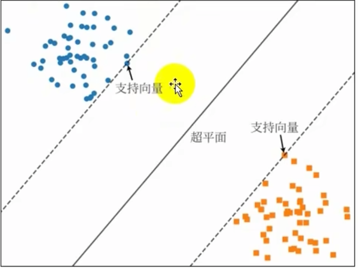
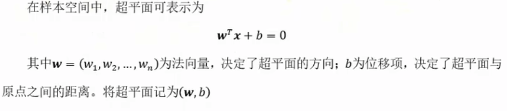

2）间隔与最大距离
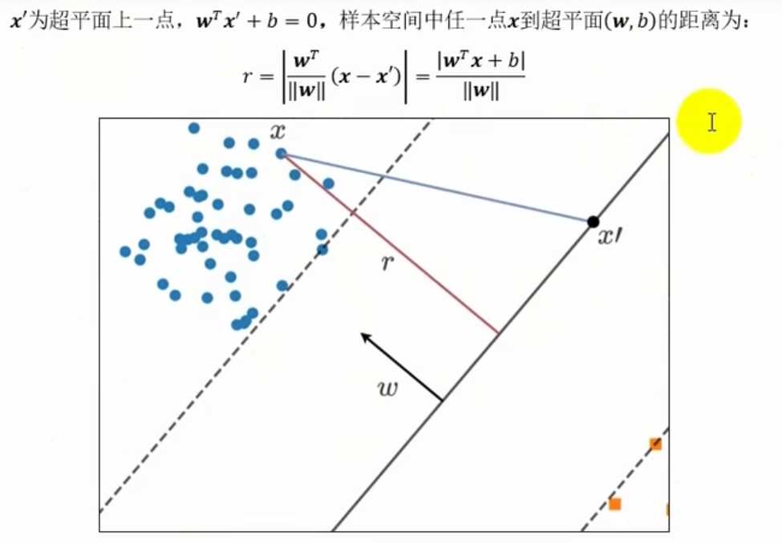 
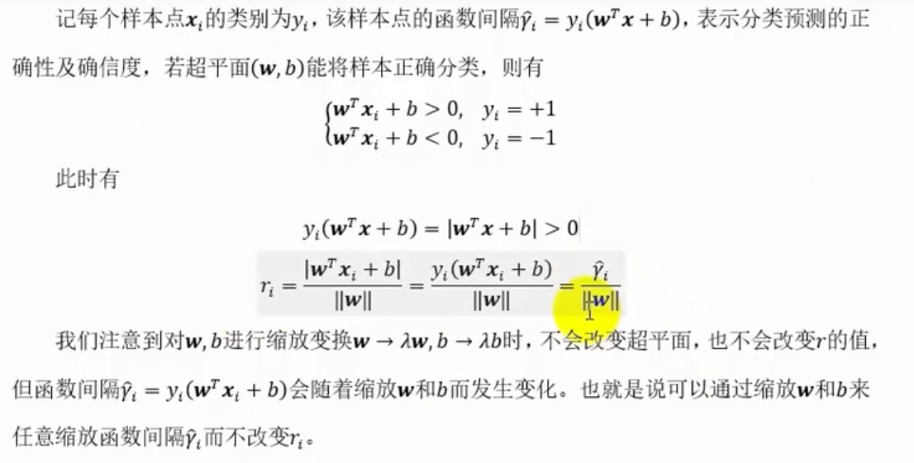
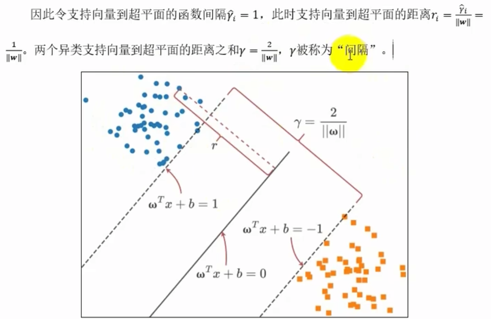
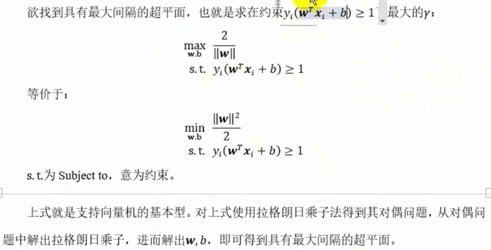

## 线性支持向量机-软间隔
先前我们假定训练样本在样本空间中线性可分，但现实中很可能并非如此，此时我们无法找出一个合适的超平面将所有样本点完全正确划分。
通常训练数据汇总会有一点特异点，如果将这些特异点去掉，剩下大部分样本点事可分的。这时我们可以放宽条件，允许某些样本分错，为此我们引入软间隔。
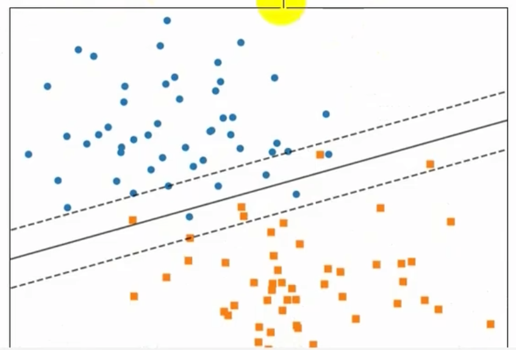
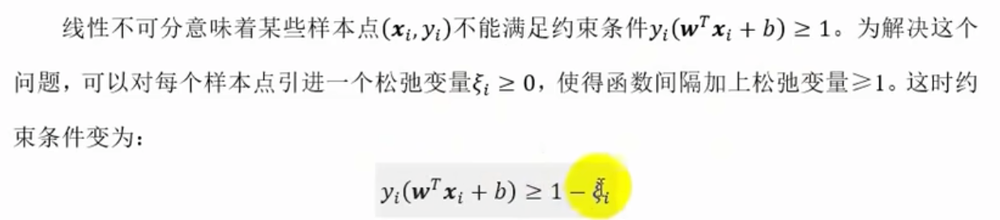
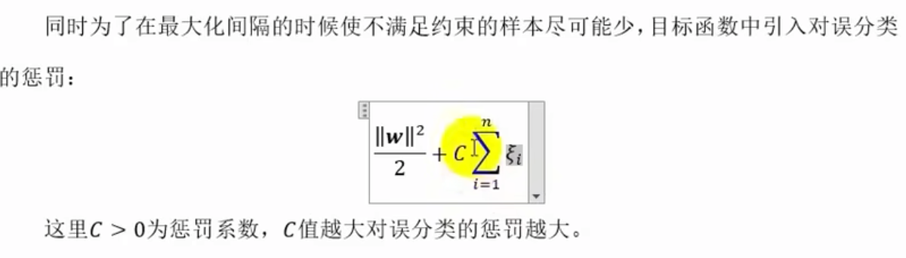
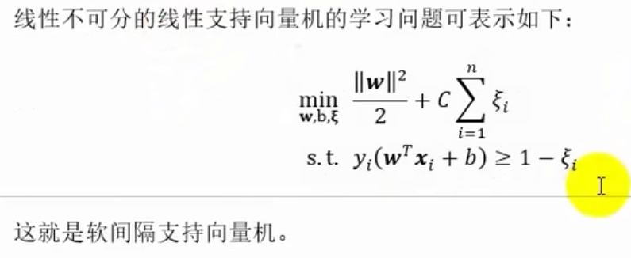

## 非线性支持向量-核函数
非线性支持向量机（Nonlinear Support Vector Machine，NSVM）是一种非线性分类模型，用于非线性可分问题。其目标是找到一个最优的超平面将数据集进行划分，使得不同类别的数据点被尽可能多地分开。非线性支持向量机通过最大化类间间隔来实现这一点，从而提高分类的准确性和泛化能力。
非线性问题，是指通过利用非线性模型才能很好地进行分类的问题，如下图是无法直接使用超平面对其分类的：
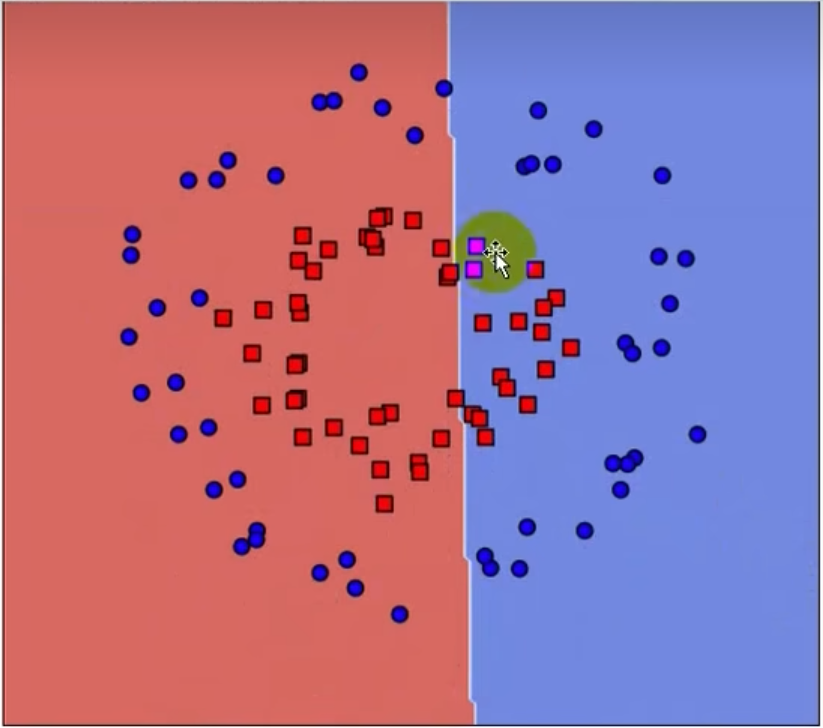
这时我们可以通过核函数将数据从原始空间映射到高维特征空间，使得数据在高维特征空间线性可分，将原本的非线性问题转换为线性问题。使用
该技巧学习费线性支持向量机，等价于隐式地在高维特征空间中学习线性支持向量机。
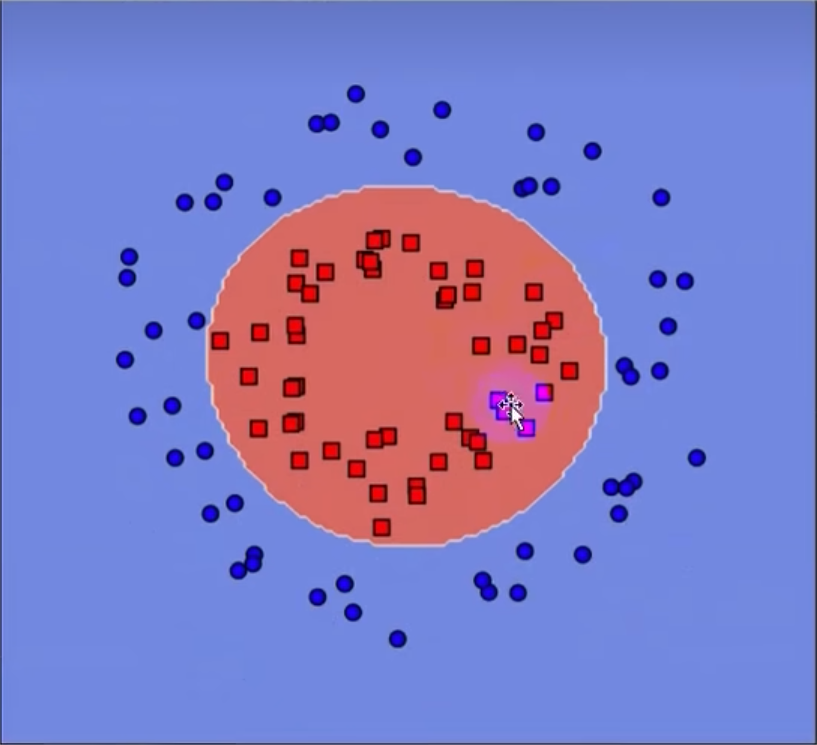
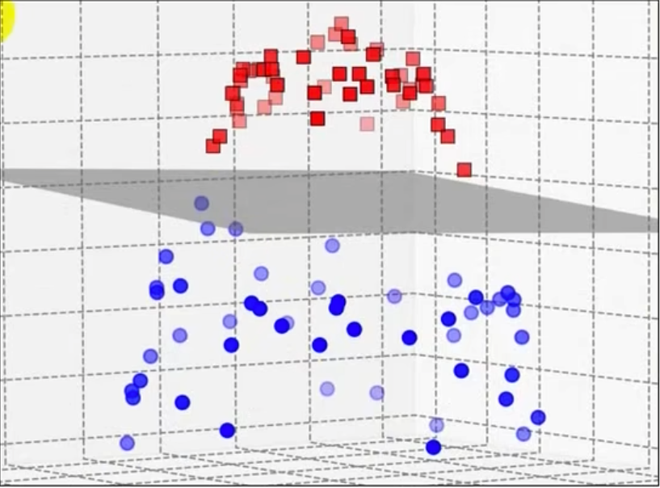
核函数的选择也是支持向量机最大的变数，若核函数选择不合适，意味着将样本映射到了一个不合适的特征空间，很可能导致性能不佳。下面是几种常用的核函数：
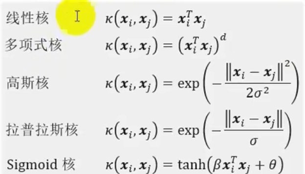